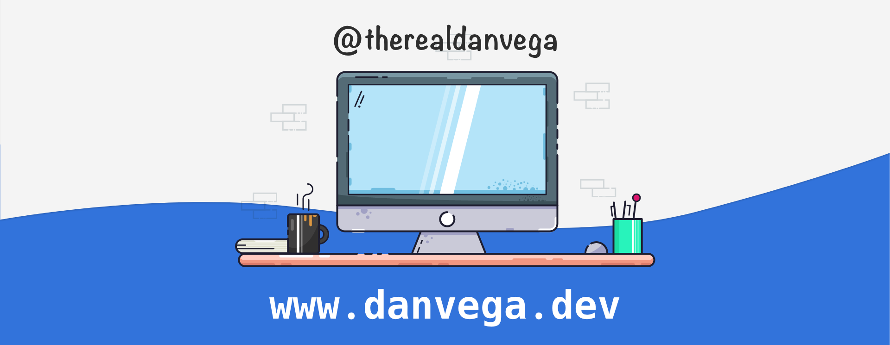

### Hi there 👋

I’m a Husband, Father, [Spring Developer Advocate](https://tanzu.vmware.com/developer/advocates/) and maker of things from Cleveland Ohio. I have a real passion for teaching and I hope that one of my blog posts, videos or courses helps you solve a problem or learn something new.

### 🤝 Connect with me:

- Website: https://www.danvega.dev
- Twitter: https://twitter.com/therealdanvega
- YouTube: http://www.youtube.com/danvega
- LinkedIn: https://www.linkedin.com/in/danvega

### 📝 Latest Blog posts

<!-- BLOG-POST-LIST:START -->
- [The Number One Spring Boot Starter You Should Include in Every Project](/blog/2023/09/17/spring-boot-starter)
- [A First Look at the new JDBC Client in Spring Boot 3.2](/blog/2023/09/11/spring-jdbc-client)
- [A First Look at the new Rest Client in Spring Boot 3.2](/blog/2023/09/08/rest-client-first-look)
- [Streamline Your Development: Spring Boot with PostgreSQL &amp; pgAdmin in Docker](/blog/2023/07/17/pgadmin-docker-compose)
- [Spring for GraphQL Schema Mapping Inspection Report](/blog/2023/07/13/graphql-schema-mapping-inspection)
<!-- BLOG-POST-LIST:END -->

### 🖥 Latest YouTube Videos

<!-- YOUTUBE:START -->
- [What is an API Gateway?](https://www.youtube.com/watch?v=gswspnb6wYI)
- [What is Spring Cloud Gateway?](https://www.youtube.com/watch?v=o_h8BR2BcFk)
- [Introduction to Spring Cloud Gateway](https://www.youtube.com/watch?v=SukqRvTfZwM)
- [Spring Boot Testing - Batteries Included](https://www.youtube.com/watch?v=cjVRFjCzlLk)
- [Spring Boot Testing - ** Batteries Included 🔋🔋](https://www.youtube.com/watch?v=rUbjV3VY1DI)
<!-- YOUTUBE:END -->
